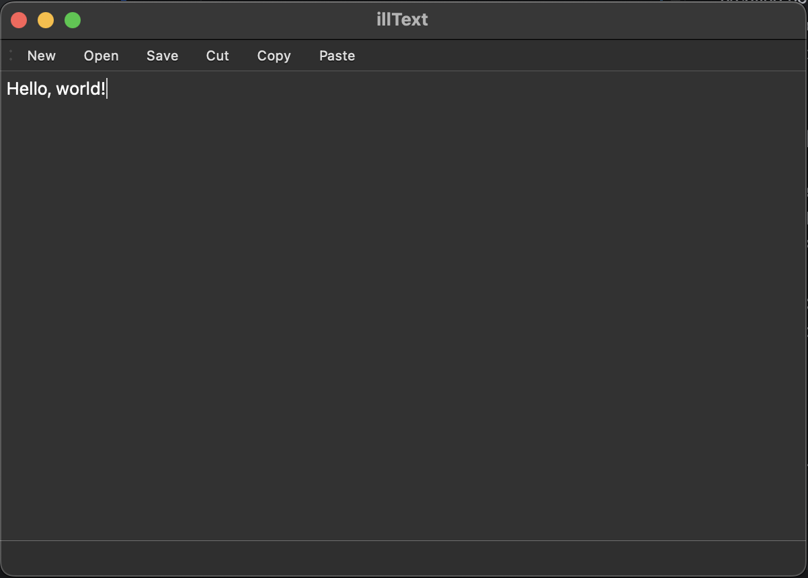

# illText - Simple Text Editor

illText is a simple and user-friendly text editor built using C++ and the Qt framework. It provides basic text editing functionalities such as creating new files, opening existing files, saving files, and basic text manipulation operations like copy, paste, and cut. This editor also features a transparent text editing area to give it a sleek, modern look.

## Features

- **Create New File**: Start with a blank text document.
- **Open File**: Open and edit existing text files.
- **Save File**: Save your work to a file.
- **Copy, Paste, Cut**: Easily manipulate text.
- **Transparent Text Area**: The text area is transparent, allowing the background to show through.

## Screenshots



## Installation

### Prerequisites

To build and run illText, you need the following installed on your system:

- **C++ Compiler**: Ensure you have a C++17 compatible compiler installed (e.g., GCC, Clang).
- **Qt 6.x**: Make sure Qt is installed and configured correctly. You can install it via your package manager or download it from the [Qt website](https://www.qt.io/download).
- **CMake**: Required for building the project.
- **CLion (Optional)**: If you prefer using an IDE, CLion is recommended for this project.

### Steps to Install and Run

1. **Clone the Repository**:
    ```bash
    git clone https://github.com/yourusername/illText.git
    cd illText
    ```

2. **Configure the Project with CMake**:
    ```bash
    cmake -B build -S .
    ```

3. **Build the Project**:
    ```bash
    cmake --build build
    ```

4. **Run the Application**:
    ```bash
    ./build/illText
    ```

### macOS Specific Notes

On macOS, if you encounter issues related to missing headers like `type_traits`, make sure you have the correct developer tools installed:

- Ensure you have the Command Line Tools installed:
    ```bash
    xcode-select --install
    ```

- If using Homebrew, ensure Qt is correctly linked:
    ```bash
    brew install qt
    brew link qt --force --overwrite
    ```

- You may need to update your CMakeLists.txt to ensure the correct paths for the Qt libraries.

## Usage

- **New File**: Use the `New` button or menu item to start a new document.
- **Open File**: Use the `Open` button or menu item to open an existing file.
- **Save File**: Use the `Save` button or menu item to save your work.
- **Copy/Paste/Cut**: These operations are available via the `Edit` menu or keyboard shortcuts.

## Customization

You can customize the appearance of illText by editing the `illtext.ui` file using Qt Designer, or by modifying the stylesheets in `illtext.cpp`.

## Contributing

Contributions are welcome! Please feel free to submit a pull request or open an issue to discuss improvements.

## License

This project is licensed under the MIT License. See the [LICENSE](LICENSE) file for more details.

## Acknowledgments

- Qt Framework: [https://www.qt.io/](https://www.qt.io/)
- CLion IDE: [https://www.jetbrains.com/clion/](https://www.jetbrains.com/clion/)
